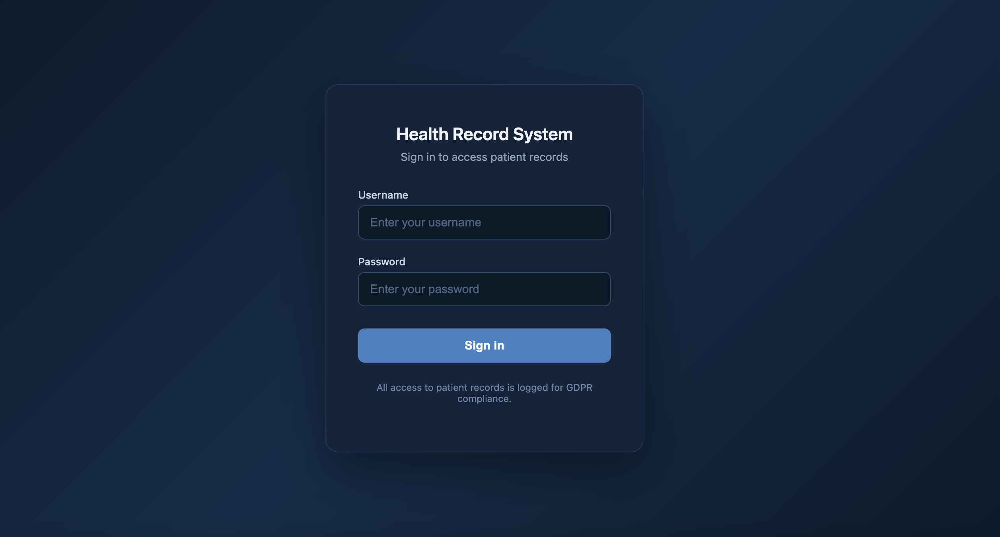
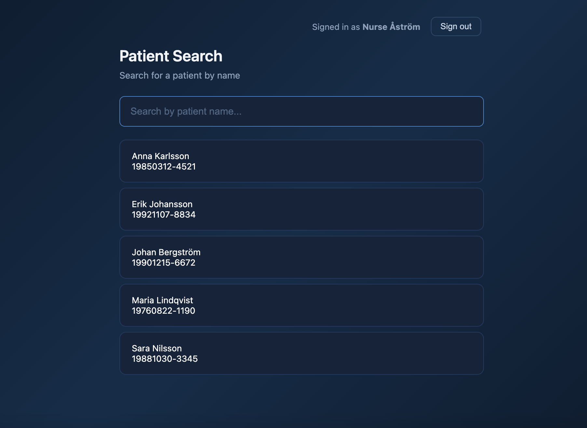
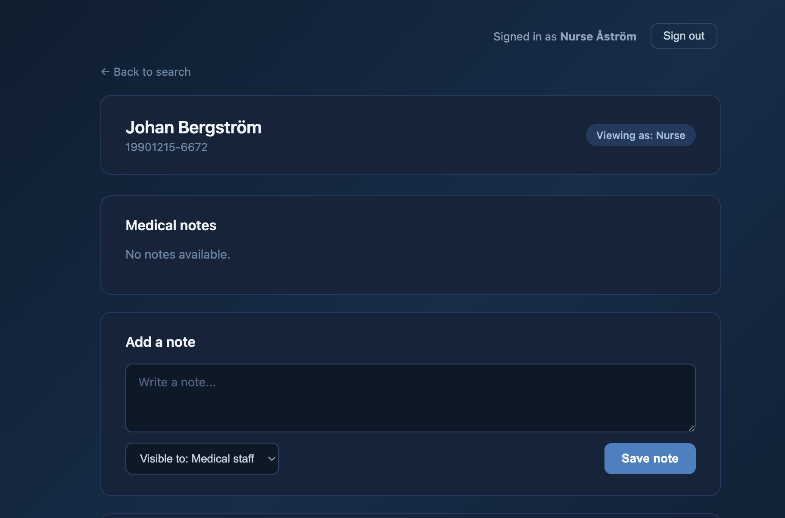
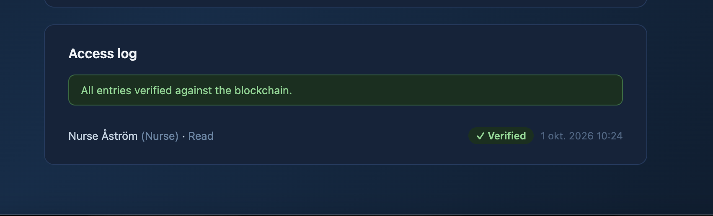
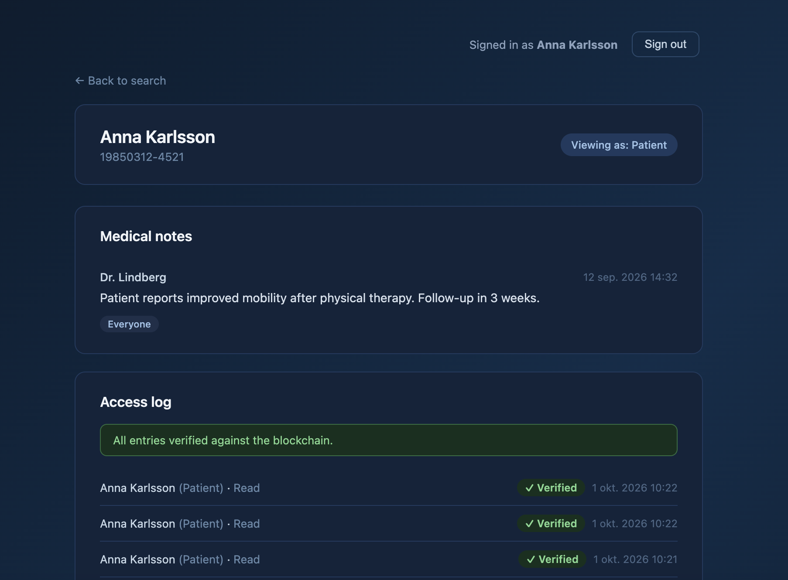
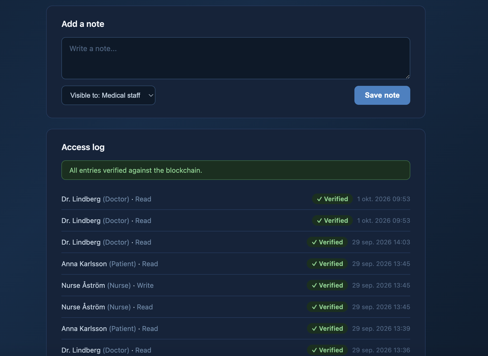
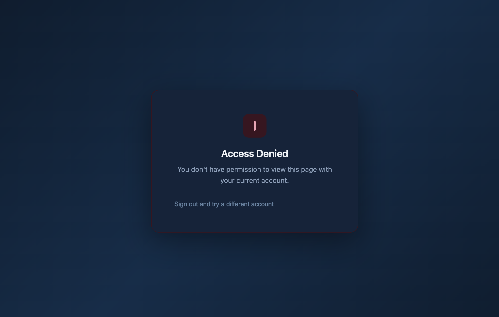
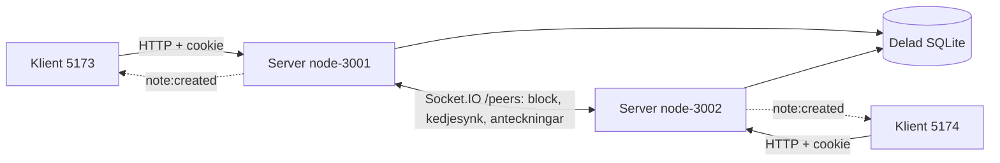

# BCU-nodejs-grupp5

Ett journalsystem där varje läsning och ändring av en journal loggas i en signerad
blockkedja, så att patienten själv kan se vem som har läst journalen.

## Om projektet

### Problemet

Enligt GDPR har en patient rätt att veta vem som har tagit del av uppgifterna i
journalen. En vanlig loggtabell i databasen går att ändra i efterhand av den som har
åtkomst till databasen, och då går det inte att lita på loggen.

### Lösningen

- **Journaldata i SQL.** Patienter, användare och anteckningar ligger i en
  SQLite-databas. Servern filtrerar anteckningar efter roll och synlighet innan
  svaret skickas.
- **Signerade åtkomstloggar i blockkedjan.** Varje lyckad journalläsning blir ett
  `read`-block och varje ny anteckning ett `write`-block. Blocket innehåller vem
  (`userId`, `role`), vilken patient (`patientId`), vad (`action`), när
  (`timestamp`) och en Ed25519-signatur. Blocken är länkade med SHA-256-hashar, så
  en ändring i ett gammalt block syns vid verifiering.
- **P2P mellan två servrar.** Två serverinstanser skickar nya block till varandra
  över Socket.IO och synkar varandras kedjor. Access-log-vyn visar block från båda
  noderna.
- **Live-anteckningar via socket.** En ny anteckning skickas som `note:created` till
  inloggade klienter som har journalen öppen, på båda servrarna, och bara till de
  som får se anteckningen.

**Journalinnehåll lagras aldrig i kedjan.** Anteckningstext, namn och personnummer
finns bara i SQL. Kedjan innehåller endast id:n, roll, åtgärd, tid och signatur
(docs/kontrakt.md, beslut c).

### Roller

| Roll | Kan |
|---|---|
| `doctor`, `nurse`, `clinic` | Söka patienter, läsa alla journaler och access-loggar, skriva anteckningar |
| `patient` | Läsa sin egen journal och access-logg, bara anteckningar med synlighet `everyone` |
| `unauthorized` | Logga in, men nekas all journalåtkomst |

Anteckningar har synligheten `private` (bara författaren), `staff` (all personal)
eller `everyone` (personal och patienten själv). Hela matrisen finns i
[docs/permissions.md](docs/permissions.md).

## Skärmdumpar


| Vy | Bild |
|---|---|
| Inloggning |  |
| Sökning (personal) |  |
| Journal som sjuksköterska |  |
| Access-logg med verifiering |  |
| Journal som patient |  |
| Journal som patient (fler anteckningar) |  |
| Åtkomst nekad |  |

## Kom igång

### Krav

- **Node.js 22 (minst 22.12) eller 24.** Kraven kommer från beroendena:
  `better-sqlite3` kräver Node 22 eller senare, Vitest 5 kräver 22.12, 24 eller 26,
  och Vite 8 kräver 20.19 eller 22.12. Projektet är testat med Node 24.
- npm (följer med Node) och Git.

### Installation

Från repots rot:

```bash
cd server
npm install
cd ../client
npm install
```

Windows: om `npm install` eller `npm ci` försöker bygga better-sqlite3 och ger
Python-fel har projektets låsta paket verifierats med `npm ci --ignore-scripts` i
`server/`. Det använder den medföljande binären. Kör sedan `npm test` för att
kontrollera installationen.

### Miljövariabler för servern

Servern läser en env-fil. Mallen är `server/.env.example`. Vilken fil som läses styrs
med `--env <fil>`, standard är `server/.env`.

| Variabel | Används till | Standard |
|---|---|---|
| `PORT` | Porten servern lyssnar på. Obligatorisk. | – |
| `NODE_ID` | Nodens id. Hamnar i varje block i nodens kedja. | `node-<PORT>` |
| `NODE_URL` | Nodens egen adress i `peer:hello`. Valfri. | `http://localhost:<PORT>` |
| `PEER_URL` | Adressen till den andra servern. | ingen peer |
| `PEER_SECRET` | Delad hemlighet för `/peers`. Samma värde på båda servrarna. Utan den avvisas alla peers och ingen synk sker. | ingen |
| `CLIENT_ORIGIN` | Klientens adress, för CORS med cookies. | `http://localhost:5173` |
| `DB_PATH` | SQLite-filen, relativt `server/`. Samma fil för båda servrarna. | `../data/journal.db` |
| `JWT_SECRET` | Hemlighet för inloggningscookien. Samma värde på båda servrarna. | ett utvecklingsvärde, med varning |

`PEER_SECRET` och `JWT_SECRET` ska vara slumpade och får aldrig checkas in eller
läggas i en `VITE_`-variabel. Ett värde kan skapas med:

```bash
node -e "console.log(require('node:crypto').randomBytes(32).toString('hex'))"
```

### Två servrar på samma dator (3001 och 3002)

I `server/`, skapa en env-fil per instans från mallen:

```bash
cp .env.example .env.3001
cp .env.example .env.3002
```

| Variabel | `.env.3001` | `.env.3002` |
|---|---|---|
| `PORT` | `3001` | `3002` |
| `NODE_ID` | `node-3001` | `node-3002` |
| `PEER_URL` | `http://localhost:3002` | `http://localhost:3001` |
| `PEER_SECRET` | ett slumpat värde | samma värde |
| `CLIENT_ORIGIN` | `http://localhost:5173` | `http://localhost:5174` |
| `DB_PATH` | `../data/journal.db` | samma sökväg |
| `JWT_SECRET` | ett slumpat värde | samma värde |

Starta sedan i två terminaler, från `server/`:

```bash
npm run dev:3001
npm run dev:3002
```

`npm run dev:3001` kör `node --watch-path=src src/index.js --env .env.3001`.
`npm start` startar en server med `.env` utan omstart vid ändringar.

Kontrollera att båda lever:

```bash
curl http://localhost:3001/api/health   # {"ok":true,"port":3001,"nodeId":"node-3001","patients":5}
curl http://localhost:3002/api/health   # {"ok":true,"port":3002,"nodeId":"node-3002","patients":5}
```

Båda terminalerna ska visa `peer:hello from` med den andra nodens id. Meddelanden om
nya försök medan den andra servern inte är igång är väntade.

En steg-för-steg-guide för PowerShell och demo-ordningen finns i
[docs/p2p-architecture.md](docs/p2p-architecture.md).

### Klienten

Klienten ligger i `client/` (React + Vite). Den läser serverns adress från
`VITE_API_URL`:

```bash
cd client
cp .env.example .env     # VITE_API_URL=http://localhost:3001
npm run dev              # http://localhost:5173
```

En andra klient mot server 2 startas i en egen terminal. Variabeln i skalet går före
`.env`:

```bash
VITE_API_URL=http://localhost:3002 npm run dev -- --port 5174 --strictPort
```

I PowerShell: `$env:VITE_API_URL = 'http://localhost:3002'` och sedan
`npm run dev -- --port 5174 --strictPort`.

Cookies på `localhost` delas mellan portar, så använd olika webbläsarprofiler eller
privata fönster för olika roller.

### Seed-data och testkonton

Databasen skapas automatiskt från `docs/database.sql` första gången en server startar
och tabellerna saknas. Den innehåller fem patienter, tre anteckningar på patient 1
(en per synlighet) och ett konto per roll. Lösenordet är `demo1234` för alla.

| Användarnamn | Roll | Namn | Kopplad patient |
|---|---|---|---|
| `doctor1` | `doctor` | Dr. Lindberg | – |
| `nurse1` | `nurse` | Nurse Åström | – |
| `clinic1` | `clinic` | Vårdcentralen Centrum | – |
| `patient1` | `patient` | Anna Karlsson | patient 1 |
| `unauthorized1` | `unauthorized` | Obehörig Testsson | – |

Access-loggar seedas inte, eftersom varje rad måste motsvara ett riktigt signerat
block. För en ny demo räcker ett nytt `DB_PATH`. Byts seed-kontona ut måste den gamla
databasen tas bort, tillsammans med `<dbFile>.keys/` och `<dbFile>.chains/`.

### Tester

```bash
cd server
npm test          # vitest run
```

Testerna använder temporära SQLite-filer, nyckelkataloger och env-filer, så
`data/journal.db` påverkas inte. De täcker bland annat block, signering, verifiering
och manipulering av kedjan, persistens och återställning över omstart, P2P-broadcast
och kedjesynk, behörighetsmatrisen, `POST /api/patients/:id/notes` med synlighet och
live-leverans av `note:created`, samt fail-closed-loggning.

Klienten byggs med `cd client && npm run build`, och `npm run lint` kör ESLint.

## Arkitektur



### En kedja per nod

Varje server skriver bara till sin egen kedja, och varje block bär nodens
`nodeId`. En mottagen kedja sparas som en separat, skrivskyddad kopia och verifieras
block för block (hash, länk, nodtillhörighet och signatur) innan den godtas.

Eftersom bara en nod någonsin lägger till block i en viss kedja kan två noder inte
skapa konkurrerande block på samma plats. Det uppstår alltså inga forks, och därför
behövs ingen longest chain rule. Uppgiften föreslår longest chain, men den regeln
löser forks genom att kasta den kortare grenen. I ett revisionssystem får ett
åtkomstblock aldrig kastas, eftersom en borttagen läsning är precis det loggen ska
skydda mot. En kopia som inte stämmer med den historik vi redan har avvisas i
stället, och den egna kedjan ersätts aldrig av inkommande data.

Access-log-vyn (`GET /api/patients/:id/access-log`) slår ihop den egna kedjan och
alla mottagna kopior, filtrerar på patient och sorterar på tid, nyast först. Varje
post har `verified`, som visar om kedjan och användarens signatur stämmer.

### Fail-closed-loggning

Loggningen är fail-closed (#105):

- En journal lämnas aldrig ut om åtkomsten inte kunde loggas. Servern skriver
  read-blocket innan journalen skickas. Misslyckas signering eller lagring svarar
  servern `503` med `{ "message": "Access could not be logged" }` och skickar ingen
  journaldata.
- En ny anteckning räknas som skapad först när write-blocket finns. Misslyckas
  loggningen tas anteckningen bort igen, servern svarar `503` och inget skickas live.
  `note:created` skickas bara när write-blocket är skrivet.

Mer om P2P-flödet finns i [docs/p2p-architecture.md](docs/p2p-architecture.md),
[docs/p2p-test.md](docs/p2p-test.md) och
[docs/live-notes-integration.md](docs/live-notes-integration.md). API, blockformat och
socket-events beskrivs i [docs/kontrakt.md](docs/kontrakt.md).

## Databasens struktur

Båda servrarna på samma dator delar en SQLite-fil (`DB_PATH`) i WAL-läge, så att en
server kan läsa medan den andra skriver. Servern sätter `journal_mode = WAL`,
`foreign_keys = ON` och `busy_timeout = 5000`. CREATE-scriptet med seed-data är
[docs/database.sql](docs/database.sql). Kolumnerna heter `snake_case` i databasen och
`camelCase` i API:t. Tider sparas som ISO 8601-text i UTC.

| Tabell | Syfte | Kolumner |
|---|---|---|
| `patients` | Personer som har en journal | `id`, `full_name`, `personal_id` (unik), `created_at` |
| `users` | Alla som kan logga in | `id`, `username` (unik), `password_hash` (scrypt), `display_name`, `role`, `linked_patient_id`, `public_key`, `created_at` |
| `notes` | Journalanteckningar. Texten finns bara här, aldrig i kedjan. | `id`, `patient_id`, `author_id`, `text`, `visibility`, `created_at` |
| `access_logs` | SQL-index över den egna nodens block | `id`, `block_hash` (unik), `node_id`, `block_index`, `user_id`, `patient_id`, `action`, `timestamp` |

Relationer:

- `users.linked_patient_id` → `patients.id`. Sätts bara för rollen `patient`, vilket
  kontrolleras med en CHECK.
- `notes.patient_id` → `patients.id` (raderas med patienten) och
  `notes.author_id` → `users.id`.
- `access_logs.user_id` → `users.id` och `access_logs.patient_id` → `patients.id`.
  `(node_id, block_index)` är unikt.

Kontroller i schemat: `role` är en av de fem rollerna, `visibility` är `private`,
`staff` eller `everyone`, `action` är `read` eller `write`, och en anteckning får inte
vara tom.

`users.public_key` är användarens publika Ed25519-nyckel och används för att
verifiera signaturerna i kedjan. Kedjan är sanningen. `access_logs` används vid start
för att kontrollera att den sparade kedjan stämmer med SQL, men access-log-vyn läses
från kedjorna.

Utöver databasfilen skapar servern två kataloger bredvid den, som båda ignoreras av
Git: `<dbFile>.keys/` med användarnas privata nycklar och `<dbFile>.chains/` med
en JSON-fil per nods kedja. Databas, `.keys` och `.chains` hör ihop och ska
säkerhetskopieras och tas bort tillsammans.

## Kända begränsningar

- **Logout rensar bara cookien.** JWT:n spärras inte på servern, så en kopierad
  token är giltig tills den löper ut (8 timmar).
- **Nycklarna hanteras av servern.** Nyckelparet skapas första gången en användare
  loggas i kedjan. Den privata nyckeln sparas okrypterad som PEM-fil i
  `<dbFile>.keys/`, med ägarrättigheter på Unix. Det är serversignering, inte en
  personlig signatur i webbläsaren. Den som kommer åt katalogen kan signera som
  användaren.
- **En delad databas.** Demon kör båda servrarna på samma dator med samma SQLite-fil.
  Två datorer med var sin databasfil delar inte anteckningar, användare eller
  publika nycklar.
- **Peers identifieras med en delad hemlighet.** `verified` visar att kedjan och
  signaturerna stämmer, men autentiserar inte den nod som skickade blocket.
- **Mottagna kedjor ligger i minnet.** Bara den egna kedjan sparas på disk. Kopior
  från den andra noden byggs upp igen med kedjesynk när den svarar.
- **Klienten är inte helt kopplad till API:t än.** Sökningen och journalvyn använder
  mockdata tills #64 är klar. Access-loggen, anteckningsformuläret och live-events
  går redan mot riktigt API och socket.

## Arbetssätt

- **GitHub Issues med milestones:** v38 Skelett, v39 Bredd och v40 Stäng. Varje
  uppgift är ett issue med ett "Klart när"-villkor.
- **PR med granskning innan main.** `main` är skyddad och kräver en godkänd review.
  Varje issue får en egen branch och en PR med `Closes #<nr>` enligt
  [PR-mallen](.github/pull_request_template.md). Vi använder vanlig merge, eftersom
  PRs ofta bygger på varandra.
- **Datakontraktet** [docs/kontrakt.md](docs/kontrakt.md) är källan för API,
  blockformat och socket-events. Ändringar görs via PR som hela gruppen granskar.
- **Mötesanteckningar** från daily standups och möten finns i
  [docs/moten/](docs/moten/), med mallen `MALL.md`.
- **Gruppkontraktet** finns i [gruppkontrakt.md](gruppkontrakt.md).

## Gruppen

| Namn | GitHub | Huvudområde |
|---|---|---|
| Daniel | [ReJMaN83](https://github.com/ReJMaN83) | Backend: databas, inloggning, patient-routes och behörighet, audit-loggning, tester, integration och README |
| Mats | [block-dev-mats](https://github.com/block-dev-mats) | Blockkedjan: block, signering, verifiering, persistens och manipuleringstest |
| Fattma | [FattmaJoaque](https://github.com/FattmaJoaque) | Frontend: React-klienten, inloggning, sökning, patientvy och skyddade routes |
| Aamod | [Balanceisjoy](https://github.com/Balanceisjoy) | P2P: Socket.IO mellan servrarna, block-broadcast, kedjesynk och live-anteckningar |

## Teknisk referens

Detaljerade beskrivningar av de enskilda delarna, skrivna i samband med respektive
issue.

### P2P-hälsning (#22)

Med två instanser igång enligt ovan ska båda terminalerna visa `peer:hello from`
följt av den andra nodens id, adress och kedjelängd. `PEER_URL` anger den andra
servern. Socket.IO ansluter automatiskt igen om den startar senare eller startas om.
Eftersom båda noderna ansluter kan två hälsningar per nod visas; varje anslutning
skickar en hälsning i vardera riktningen. Inkommande hälsningar utlöser inga svarsslingor.

`NODE_URL` är valfri och anger nodens egen adress i hälsningen (standard
`http://localhost:PORT`). Vid körning på olika datorer ska den sättas till den egna
LAN-adressen och `PEER_URL` till den andra datorns adress. Hälsningen identifierar
noden men autentiserar den inte. Blocköverföring och verifiering hör till #39.
Ctrl+C stänger både inkommande och utgående Socket.IO-anslutningar.

### Signerade access-event

Implementationsval under review: serverhanterade Ed25519-nycklar, publik PEM/SPKI
i `users.public_key` och privat PEM/PKCS8 i `<dbFile>.keys/<userId>.pem`.
Kataloger med suffix `.keys` ignoreras av Git. På Unix skapas katalogen med `700`
och nyckelfilen med `600`; lagring som andra användare har rättigheter till avvisas.

Modulen öppnar ingen databas själv. Använd den befintliga anslutningen `db` och
absoluta sökvägen `dbFile` från `server/src/db.js`:

```js
const signing = createAccessSigner(db, `${dbFile}.keys`);
const data = signing.signAccessEvent({ userId, role, patientId, action }, timestamp);
const block = blockchain.addBlock(data, timestamp);
const validSignature = signing.verifyAccessEvent(block.data, block.timestamp);
```

Importera `createAccessSigner` från `server/src/access-signing.js`. Båda servrarna
ska använda samma databasfil och exakt samma nyckelkatalog, oberoende av `NODE_ID`.
Signering startar en egen SQLite-transaktion med `BEGIN IMMEDIATE` och ska anropas
utanför en redan pågående transaktion. En komplett nyckelfil publiceras atomiskt
utan överskrivning. En registrerad nyckel med saknad, korrupt eller felaktig privat
fil ger fel; ingen automatisk rotation görs.

Backend ansvarar för inloggning och journalbehörighet. Använd samma uttryckliga
`timestamp` vid signering och blockskapande. Verifiering använder användarens
registrerade publika nyckel och skapar inga nycklar. Detta är serverhanterad
signering, inte en personlig webbläsarsignatur. `Blockchain.isValid()` kontrollerar
fortfarande bara struktur och hashar.

### Access-logg för backend

Den namngivna exporten `chain` finns i `server/src/chain.js`. Från exempelvis
`server/src/middleware/auditLogger.js` kan Daniel anropa:

```js
import { chain } from '../chain.js';

const block = chain.addAccessLog({
  userId: authenticatedUser.id,
  role: authenticatedUser.role,
  patientId,
  action: 'read', // eller 'write'
});
```

Eventet får innehålla endast `userId`, `role`, `patientId` och `action`.
Anropet är synkront: modulen skapar en tidsstämpel, signerar och lägger till ett
block med samma tidsstämpel. Det skapade blocket returneras; ogiltig befintlig
kedja, felaktigt event, användar-/rollkonflikt eller signeringsfel kastar fel utan
att lägga till block. Skicka inte vidare en hel request-body.

Exporten återanvänder samma lokala `Blockchain`, tillgänglig som
`chain.blockchain`, under processens livstid. Den använder `config.nodeId`,
befintlig `db` och `${dbFile}.keys`. För separata instanser eller tester finns
`createAccessLog(nodeId, db, keyDirectory, chainFile)` i `server/src/access-log.js`.
Fjärde argumentet är en explicit filsökväg; utan det arbetar isolerade tester
fortfarande bara i minnet. Kärnmodulen öppnar ingen databas själv.

Backend ansvarar för autentisering, journalbehörighet, verifierad `userId`/`role`,
att `patientId` avser den faktiska journaloperationen och samordning med
journal-/anteckningsskrivningen. Anropa utanför en pågående SQL-transaktion;
annars kastas fel och anroparens transaktion lämnas öppen. Journaldata,
nyckelfiler och kedjan ingår inte i en gemensam atomisk transaktion.

Produktions-exporten återställer den egna kedjan vid start och sparar efter varje
lokalt blocktillägg innan `addAccessLog` returnerar. Vid lagringsfel kastas fel och
just det nya blocket tas bort ur minneskedjan. Signeringens eventuella
nyckelregistrering rullas inte tillbaka. `auditLogger` kan därefter indexera det
returnerade blocket i SQL och skicka det till peers med `block:new` (#39).

### Lokal kedjepersistens (#30)

Hela den lokala kedjan lagras som en JSON-array i
`<dbFile>.chains/<sha256(NODE_ID)>.json`. `chainFilePath(dbFile, nodeId)` i
`server/src/chain-storage.js` beräknar den absoluta sökvägen. SHA-256 av nodnamnet
ger ett filnamn med fast längd utan sökvägsdelar. Två noder som delar databas har
separata filer. För `NODE_ID=node-3001` är filnamnet:

```text
97985c055e5d64ff413f49a7018c711ad74849759efe965421b65c5e3953ad4f.json
```

Vid start läses JSON utan att blocken rekonstrueras. Hela kedjan kontrolleras med
`verifyChain` mot konfigurerad nod och `users.public_key` innan den tilldelas
`chain.blockchain.chain`. Fältordning, tidsstämpeltext och hashar bevaras.
Historiska block kan återställas utan privata nyckelfiler; dessa behövs däremot
för nya signerade block.

Före varje beständigt tillägg verifieras även minneskedjans signaturer, och hela
dess befintliga historik måste motsvara senast lästa/sparade JSON-kedja. Ändrad
eller avkortad minneshistorik ger fel före signering och blocktillägg. Filen och
SQL-indexet lämnas kvar; minneshistoriken repareras inte automatiskt.

Varje befintlig SQL-rad i `access_logs` för den lokala noden måste peka på samma
blockindex och hash i kedjan. Korrupt JSON, ogiltig kedja, SQL-avvikelse eller
saknad kedjefil trots lokal SQL-historik ger startfel. Filen repareras eller
skrivs inte över. Saknas både fil och lokal SQL-historik börjar noden med genesis;
filen skapas vid första lyckade blocktillägget. En kedja som ligger före SQL-indexet
godtas, men saknade indexrader byggs inte upp automatiskt.

**Efter uppgradering till #30:** en databas där servern redan loggat läsningar utan
kedjefil ger startfelet `Cannot restore local chain: missing file with existing SQL
access history`. Ta bort `data/journal.db*` (inklusive `.keys` och `.chains`) så
skapas en ny databas med seed-data vid start.

Lagring skriver en komplett temporär fil i samma katalog, synkar filinnehållet
och publicerar med atomisk `rename`. Nya kataloger/filer får rättigheterna
`700`/`600` på Unix och `*.chains/` ignoreras av Git. Ett fel före publicering
lämnar den tidigare filen kvar och rullar tillbaka det nya minnesblocket. Om
processen avbryts efter publicering men före SQL-indexering kan kedjan ligga före
SQL. Ett avbrott före publicering kan lämna en temporär fil som inte används vid
återställning. Strömavbrottets påverkan på katalogmetadata garanteras inte.

Kör bara en skrivande process per kombination av databas och `NODE_ID`. En fil
som ändrats eller tagits bort sedan instansen läste/skrev den avvisas vid nästa
skrivning, men detta är inget lås för samtidiga skrivare. Endast den egna lokala
kedjan lagras på disk; peer-repliker hålls i minnet och byggs upp igen med chain-sync (#40).

### Accesslogg i kedjan

Varje lyckad `GET /api/patients/:id` blir ett signerat block i nodens egen kedja
(`NODE_ID`) och en rad i `access_logs`. Nekade anrop och okända patienter loggas inte.
`GET /api/patients/:id/access-log` läser från kedjan och visar `verified` per post.

**Utvecklingsläge:** nyckelparet för en användare skapas första gången hen läser en
journal, och den publika nyckeln skrivs till `users.public_key`. Den lokala kedjan
sparas och verifieras vid återställning enligt avsnittet om kedjepersistens.
Broadcast till peer skickar signerade block med `block:new` (#39). Accessloggen
visar nu både den egna kedjan och verifierade kopior av anslutna peers kedjor (#40).

### Block broadcast (#39)

After both nodes exchange `peer:hello`, a successful patient-record read sends
the newly signed audit block to the peer. The receiving terminal reports
`block:new from <nodeId>: accepted`. Each receiver keeps a separate in-memory
replica of the sender's chain. It verifies the block structure, index, previous
hash, calculated hash and signature against the user's registered database key
before storing a copy. Incoming blocks are not rebroadcast or appended to the
receiver's own chain. Reciprocal connections send once per peer; duplicate
delivery does not append twice.

A missing predecessor is reported as `missing-history` and rejected without
changing stored data.
The receiver requests missing history through chain sync (#40). Persistence
remains separate work (#30). Received copies are not written
to the shared SQL index again; the originating audit operation already writes it.
Peer identity still comes from the unauthenticated hello introduced in #22;
this is a trusted demo-network transport, not authenticated node identity.
Cryptographic access-event verification does not authenticate the sending node.

Use a separate `DB_PATH` and matching JWT settings for a fresh demo if your old
database still has Swedish roles; preserve the old database and key directory.
Both demo nodes must share the new database. Log in as `doctor1`, then request
`GET /api/patients/1` with its cookie. Confirm `accepted` on the other node, then
repeat in the opposite direction. `npm test` includes this full flow with two
server processes and a temporary database, plus tampering and duplicate tests.

### Chain synchronization (#40)

After each valid peer hello (including reconnects), nodes request one another's
own chains with `chain:request` and `chain:response`. A response contains the
sender's complete chain, including genesis. All hashes, links, node IDs and
non-genesis signatures are verified before a replica is stored. Missing block
history triggers another request. Unanswered requests retry every five seconds
while connected; disconnect/shutdown clears pending timers.

Each node writes only its own chain. Read-only replicas are exposed as defensive
copies. A matching older response cannot truncate newer data, and conflicting
history is rejected rather than selected by a longest-chain rule. No incoming
history replaces the local owner's chain. The access-log endpoint combines
local and replicated chains, filters by patient and sorts newest first.

This supports the configured direct peer topology (`PEER_URL`); it does not
discover or relay arbitrary peers. Each node restores its own chain from disk at
startup (#30); peer replicas are kept in memory and rebuilt with `chain:request`
when the peer answers. See [P2P verification](docs/p2p-test.md) for tested
scenarios and the distinction between a transport outage and a process restart.

### Verifiera kedjan (#28)

`chain.verifyChain()` kontrollerar struktur, genesis, nodtillhörighet, index,
länkar, lagrade hashar och varje access-events signatur mot `users.public_key`.
`chain.verifyChain(blocks)` kontrollerar också en JSON-återläst array utan att
ersätta den egna kedjan. Förväntad nod är alltid den som instansen skapades för.

```js
const result = chain.verifyChain();
// { valid: true, position: null, reason: null }
```

Vid fel returneras `{ valid: false, position, reason }`. `position` är det första
felaktiga blockets nollbaserade plats i arrayen, inklusive genesis på plats 0,
oberoende av blockets lagrade `index`. Fel på kedjeindatan, till exempel en tom
array, ger `position: null`. `reason` är en kort felorsak på engelska.

För senare backend-/P2P-integration finns även den fristående funktionen:

```js
import { verifyChain } from './src/blockchain.js';

const result = verifyChain(blocks, expectedNodeId, signing.verifyAccessEvent);
```

Använd `verifyAccessEvent` från `createAccessSigner(db, keyDirectory)` med den
betrodda användardatabasen. Den fristående funktionen kräver verifieraren och
kastar `TypeError` om den saknas. `expectedNodeId` ska komma från anroparens
nodkonfiguration/instans, inte från kedjans påstådda identitet. Verifieringen är
synkron och använder blockets ursprungliga tidsstämpel. Den ändrar inga block,
hashar eller nycklar. `Blockchain.isValid()` behåller sitt boolean-resultat för
enbart struktur/hash, och `verifyAccessEvent` behåller sitt befintliga gränssnitt.

En giltig kedja bevisar inte att alla slutblock finns kvar. Persistensens
SQL-kontroll upptäcker avkortning om indexet fortfarande känner till senare
block, men SQL är ingen kryptografiskt betrodd referens. Gemensam manipulation
av kedja och index kan inte upptäckas generellt. Merkle-logik ingår inte.

### Reproducera manipuleringstestet (#31)

Kör från `server/` efter `npm ci`. Exemplet skapar en databas i minnet och nya
testnycklar i en temporär katalog. Det öppnar inte den vanliga demodatabasen.
Raden `copy[1].data.patientId = 99` är den manuella ändringen i JSON-kopian:

```bash
node --input-type=module <<'JS'
import Database from 'better-sqlite3';
import { mkdtempSync, readFileSync, rmSync } from 'node:fs';
import { tmpdir } from 'node:os';
import { join } from 'node:path';
import { createAccessLog } from './src/access-log.js';

const directory = mkdtempSync(join(tmpdir(), 'bcu-tamper-demo-'));
const db = new Database(':memory:');
try {
  db.exec(readFileSync('../docs/database.sql', 'utf8'));
  const chain = createAccessLog('test-node', db, join(directory, 'test.keys'));
  chain.addAccessLog({ userId: 1, role: 'doctor', patientId: 2, action: 'read' });
  const copy = JSON.parse(JSON.stringify(chain.blockchain.chain));
  console.log('Before:', chain.verifyChain(copy));
  copy[1].data.patientId = 99;
  console.log('After:', chain.verifyChain(copy));
  console.log('Original:', chain.verifyChain());
} finally {
  db.close();
  rmSync(directory, { recursive: true, force: true });
}
JS
```

Förväntat: `Before` och `Original` är giltiga. `After` ger
`{ valid: false, position: 1, reason: 'Invalid block hash' }`.
Regressionstestet finns i `server/src/chain-verification.test.js`, tillsammans
med ett test där hashar räknas om men den ursprungliga signaturen inte stämmer.

## Arbetsfördelning

# Daniel (ReJMaN83): projektledning, backend och integration
Gruppkontrakt, datakontrakt (docs/kontrakt.md) och beslut om datadelning mellan servrar
Projektstruktur för server/ med env-styrd PORT och PEER_URL
Databasschema och seed (docs/database.sql), delad SQLite-databas i WAL-läge
Inloggning med JWT-cookie (/api/auth/login, /me, /logout)
Patient-routes med requireAuth, requireRole och rollfiltrerade anteckningar, sökning
POST /api/patients/:id/notes med synlighet och write-block, publicering av note:created
Audit-loggning med signerade block i egen kedja, access-log-endpoint, fail-closed-loggning
PEER_SECRET på /peers, socket-rum och peer-namespace i kontraktet
Byte till engelska identifierare i hela koden
Tester för behörighetsmatrisen
README med installation, databasstruktur och arkitektur
Mötesanteckningar 14/9, 18/9, 21/9 och 28/9
Review-fixar i andras PRs (?), till exempel socket.io-client i #95. Det syns i commits, men omfattningen per PR är inte sammanställd.

# Mats (block-dev-mats): blockkedjan
Block-klass och Blockchain-klass med genesis, addBlock och isValid, med tester
Nyckelpar per användare och signering av access-event
addAccessLog för backend (access log service)
Signaturverifiering och verifyChain(), manipuleringstest
Persistens av kedjan per server
Klientfix: socketen återansluter efter serveromstart (#118)
Mötesanteckning 18/9
Granskade och mergade flera PRs, bland annat alla frontend-PRs 30/9

# Fattma (FattmaJoaque): frontend
React och Vite med routing och API-klient (VITE_API_URL)
Inloggningssida, sökruta och patientlista, patientvy
Patientrollen skickas direkt till sin egen journal
Sida för åtkomst nekad, skyddade routes med redirect till login
Anteckningsformulär med synlighetsval kopplat till API:t
Access-log-lista i patientvyn, live-uppdatering via socket och ack för patientrum
Verification badge, styling, felhantering och tomma tillstånd
Byte från mockdata till riktigt API för sökning och journal, rensning av Vite-mallen, redirect från /login (#64)
Mötesanteckningar för vecka 39 (21/9)
Granskade och godkände Daniels PRs (?). Det syns i reviews men är inte räknat i sin helhet.

# Aamod (Balanceisjoy): P2P
Behörighetsmatris (docs/behorighet.md)
Medansvarig för databasschemat (#18, delad assignee med Daniel) (?)
Socket.IO-anslutning mellan servrar (peer:hello)
Broadcast och validering av nya block till peers
Kedjesynk vid uppstart
Serverdelen för live-anteckningar (note:created till behöriga klienter)
Integrationstest för samtidiga loggar och omstarter
Guide för två servrar och arkitekturskiss
Mötesanteckningar 18/9 (?, issue #20 tilldelat, men PR:en är Mats #82) och 25/9