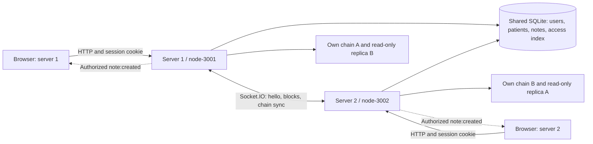

# Two-node demo and architecture (#53)

## Architecture



Each server writes only its own chain. A received chain is a separate validated
replica; it never replaces the receiver's local chain. Journal text stays in
SQLite, not in blocks. Blocks contain access-event IDs, role, action, timestamp
and cryptographic verification material. The access log combines known chains.

Solid arrows show the #22/#39/#40 implementation. Each node restores its own
chain from disk at startup (#30). Dotted arrows are live notes (#41): a saved note
is sent as `note:created` to authorized clients in the room `patient:<id>` on both
servers. Peer traffic uses the `/peers` namespace and requires `PEER_SECRET`; see
the socket section of [the data contract](kontrakt.md).

## Safe local setup (Windows PowerShell)

Use two server processes on one computer with one shared SQLite file. Do not
delete an existing database, keys or chain files. A new `DB_PATH` creates an
independent demo using the current English seed accounts.

From the repository root, install locked dependencies:

```powershell
npm ci --prefix server --ignore-scripts
npm ci --prefix client
npm test --prefix server
```

The `--ignore-scripts` option is the verified workaround for this Windows
installation's unnecessary better-sqlite3 build step. It uses the bundled binary;
the tests must pass before proceeding. It is not a global npm setting.

Create `.env.3001` and `.env.3002` in `server/` from `.env.example` if they do not
already exist. Compare before editing an existing file. Set these values:

| Setting | `.env.3001` | `.env.3002` |
| --- | --- | --- |
| `PORT` | `3001` | `3002` |
| `NODE_ID` | `node-3001` | `node-3002` |
| `NODE_URL` | `http://localhost:3001` | `http://localhost:3002` |
| `PEER_URL` | `http://localhost:3002` | `http://localhost:3001` |
| `DB_PATH` | `../data/demo-v39.db` (choose a new path) | Same exact path |
| `JWT_SECRET` | New local random secret | Same secret |
| `CLIENT_ORIGIN` | `http://localhost:5173` | `http://localhost:5174` |
| `PEER_SECRET` | New local random secret | Same secret |

`PEER_SECRET` is required: without it `/peers` rejects every peer and the nodes do
not sync (#101). Keep it server-side; never put it in a `VITE_` variable.

Start each server in a separate terminal from the repository root:

```powershell
npm run dev:3001 --prefix server
```

```powershell
npm run dev:3002 --prefix server
```

Check `http://localhost:3001/api/health` and `http://localhost:3002/api/health`.
Both should report `ok: true`, the correct node ID and five seeded patients for a
new database. Wait for `peer:hello` and successful chain responses. Initial retry
messages while the other server is not running are expected.

## Two frontend instances (when API integration is ready)

Run each command in its own PowerShell terminal from the repository root:

```powershell
$env:VITE_API_URL = 'http://localhost:3001'
npm run dev --prefix client -- --port 5173 --strictPort
```

```powershell
$env:VITE_API_URL = 'http://localhost:3002'
npm run dev --prefix client -- --port 5174 --strictPort
```

Use separate browser profiles/private sessions for different roles: cookies on
localhost are shared across ports. Search and patient details still use mock
data until #64. The access log, note form and live updates call the real API and
socket, so real notes and live events are shown through the API until then.

## Demo order and checks

1. Show health and peer hello on both nodes.
2. Log in with a fresh seed account (`doctor1`, password `demo1234`), read a real
   patient through the API and show the signed access entry on both nodes.
3. Explain that `verified` checks the chain and registered user signature; it
   does not prove clinical correctness or authenticate the remote node itself.
4. Restart a peer and show that stored history survives and missed access
   entries are synchronized (#30, #42).
5. Create a note with `POST /api/patients/1/notes` on one node and show
   `note:created` on a client in `patient:1` on the other node (#41).

Stop each process with Ctrl+C. Keep database, `.keys` and `.chains`
storage together for backup; no private files or node_modules belong in a PR.
For reproducible automated evidence, see [p2p-test.md](p2p-test.md).

## Different computers

The agreed demo uses a shared SQLite file on one computer. Two computers with
independent database files do not automatically share notes, users or trusted
public keys. Changing only `PEER_URL` does not implement database replication.
Agree a supported database deployment with the group before a two-computer demo.
Set node and peer URLs to reachable addresses, and client origins to the actual
browser origins. Do not claim the localhost tests verify this deployment.
